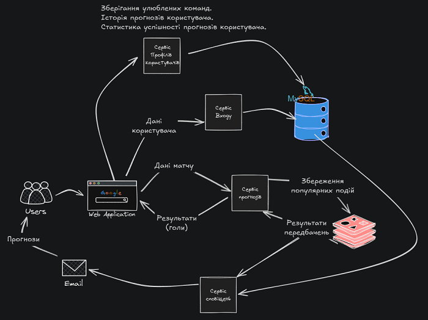

# GamePredictor ⚽🏀

**GamePredictor** is an AI-powered project designed to predict the outcomes of sports events using modern machine learning techniques. The current version focuses on football (soccer) match outcome prediction based on player data. The project includes a complete frontend-backend architecture, model training notebooks, and Docker-based deployment.

---


---

## 🔍 Overview

GamePredictor is a full-stack AI application that combines:

- A user-friendly interface for making match predictions
- A registration and login system
- An AI model trained on real-world player statistics
- API endpoints to handle predictions and user authentication
- Data caching for performance optimization

---

## 🚀 Features

- 🧠 Neural Network Model for predicting football outcomes (PyTorch)
- 🔒 User Authentication (Flask + MySQL + password hashing)
- ⚡ Frontend built with React + Vite
- 🧾 Interactive forms for inputting match data
- 📊 Jupyter notebooks for model training and data analysis
- 🐳 Dockerized microservice architecture
- 🚀 Fast Redis caching layer for prediction requests

---

## 🧱 Project Structure

```
GamePredictor/
├── frontend/                 # User Interface Components
│   ├── src/
│   │   ├── components/
│   │   │   ├── ...           # React components (e.g., prediction form, auth forms)
│   │   ├── App.jsx
│   │   └── main.jsx
│   ├── package.json
│   └── vite.config.js
├── backend/                  # Server-side Logic & AI Model
│   ├── auth_service/         # User Authentication & Management
│   │   ├── ...               # Flask app for registration and login
│   ├── forecast_service/     # AI Model & Prediction Logic
│   │   ├── notebooks/        # Jupyter notebooks for data analysis & model training
│   │   │   ├── data_analysis.ipynb
│   │   │   └── model_training.ipynb
│   │   ├── ...               # Flask app for prediction requests, data normalization
│   │   └── model.py          # PyTorch model definition
├── docker-compose.yml        # Orchestrates all services for easy deployment
├── .gitignore
└── README.md
```

---

## 🧠 Model Details

The neural network model was built using **PyTorch** and trained on real-world player performance data from [Kaggle](https://www.kaggle.com/datasets/davidcariboo/player-scores/data). The pipeline includes:

- Data cleaning and normalization
- Feature engineering
- Model training and evaluation (notebooks available)
- Deployment for prediction via a REST API

---

## 🛠️ Tech Stack

| Layer    | Technologies Used           |
| -------- | --------------------------- |
| Frontend | React, Vite, JavaScript     |
| Backend  | Python, Flask, REST API     |
| AI / ML  | PyTorch, Jupyter Notebook   |
| Caching  | Redis                       |
| Database | MySQL                       |
| DevOps   | Docker, Docker Compose, Git |



---

## 🔐 User Authentication

The `auth_service` handles:

- User registration
- Password hashing
- Login authentication
- Storing user data in MySQL

---

## 📊 Prediction Flow

The `forecast_service`:

1. Receives user input through the frontend
2. Preprocesses and normalizes data
3. Feeds it into a pre-trained model
4. Returns prediction result (currently for football only)


---

## 🐳 Running the Project with Docker

To launch the entire system, use the included `docker-compose.yml` file:

```bash
docker-compose up --build
```

Once all services are running, open your web browser and navigate to:
`http://localhost:80`

Make sure Docker is installed and running on your system. All necessary containers will be pulled from Docker Hub.

## 📬 Contact & Contributions

Feel free to fork, open issues, or suggest improvements.

- **Email:** [ugrynbogdan7@gmail.com](ugrynbogdan7@gmail.com)
- **LinkedIn:** [Bogdan Ugryn](https://www.linkedin.com/in/bogdan-ugryn-25b6572a8/)
- **GitHub:** [UgrynBohdan](https://github.com/UgrynBohdan)
